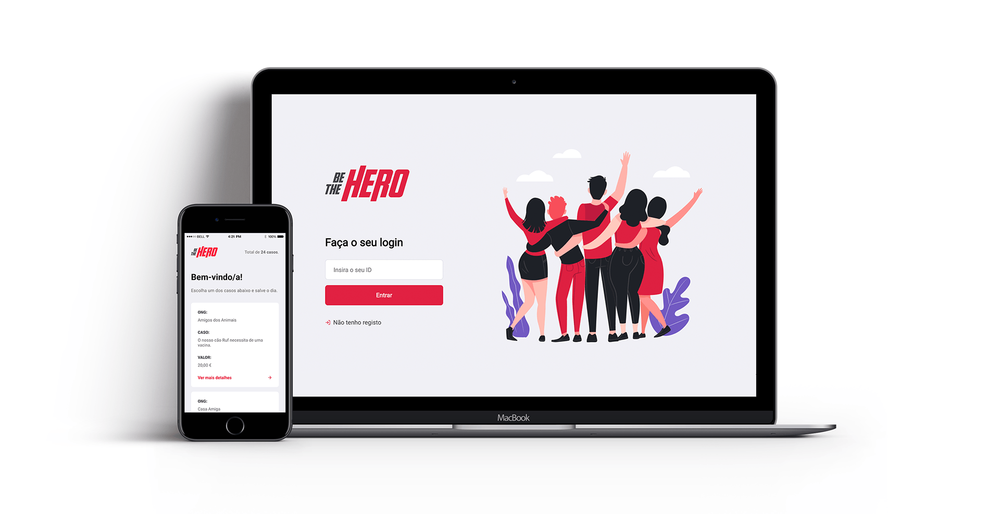

<h2 align="center">
    
</h2>

<h4 align="center">
  Projecto criado na Semana OmniStack 11.0 da <a href="https://rocketseat.com.br/" target="_blank">Rocketseat</a>
</h4>

## Tecnologias
Este projecto foi desenvolvido com as seguintes tecnologias:

- [React](https://reactjs.org)
- [Node.js](https://nodejs.org/en/)
- [SQLite](https://www.npmjs.com/package/sqlite3)
- [React Native](https://facebook.github.io/react-native/)
- [Expo](https://expo.io/)

## Projecto

  BeTheHero é um projecto pensado pela Rocketseat com o objectivo de conectar pessoas que desejam fazer contribuições monetárias a ONG's (Organizações não governamentais) que precisam de ajuda.
